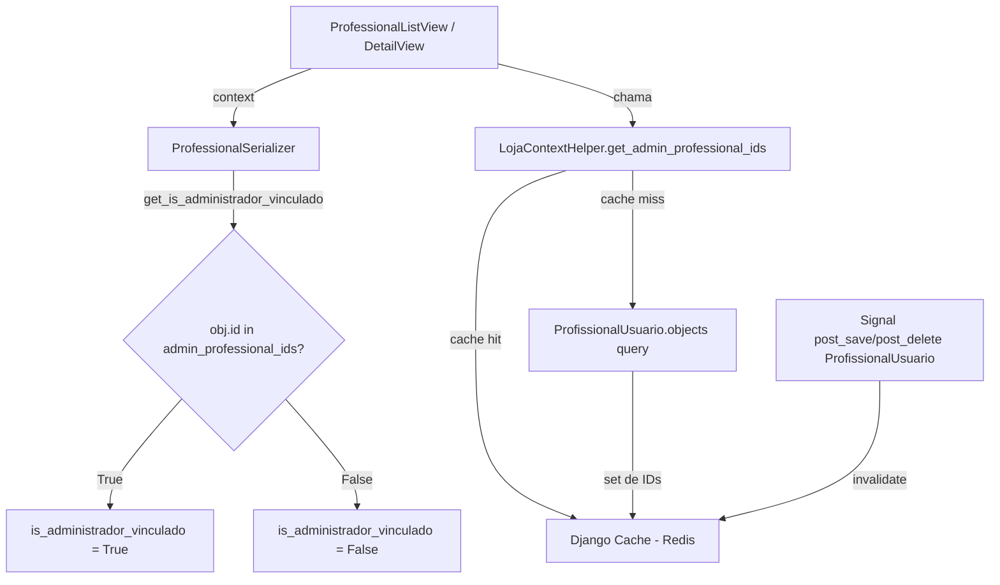
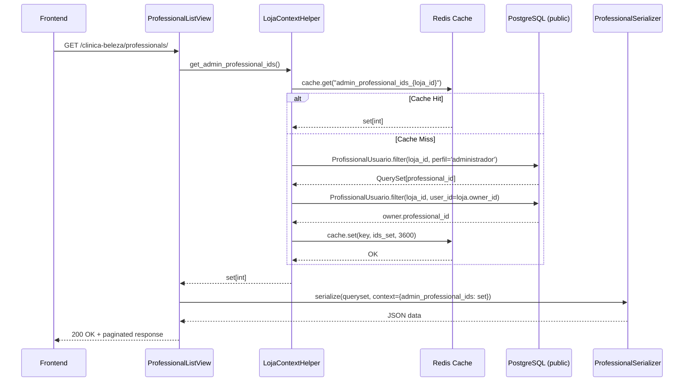
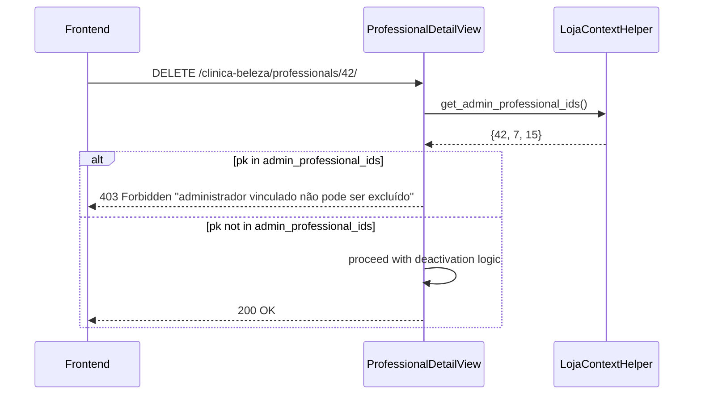
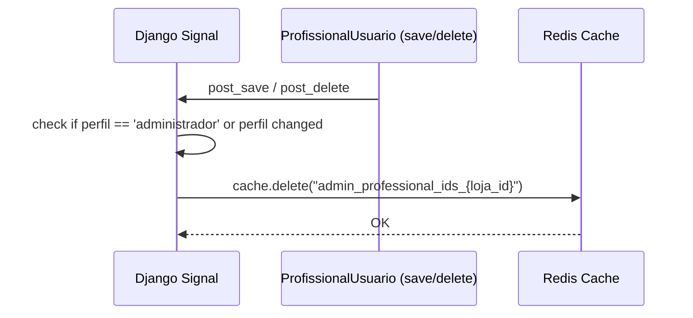

# Design Document: Admin Professional Toggle

## Overview

Esta feature estende o mecanismo de `is_administrador_vinculado` para reconhecer todos os usuários com perfil "administrador" na tabela `ProfissionalUsuario`, não apenas o owner da loja. Isso permite que qualquer administrador tenha o toggle "É profissional" visível na listagem, podendo escolher entre atuar somente como administrador ou como administrador + profissional.

A implementação foca em três camadas: um novo método utilitário com cache (`get_admin_professional_ids`), atualização do serializer para consultar um `set` de IDs ao invés de um único ID, e ajuste nas views para passar o contexto correto e expandir a proteção contra exclusão/desativação para todos os administradores.

## Architecture



## Sequence Diagrams

### Fluxo GET /professionals/ (listagem)



### Fluxo DELETE /professionals/:id/ (proteção admin)



### Fluxo de Invalidação de Cache



## Components and Interfaces

### Component 1: LojaContextHelper.get_admin_professional_ids()

**Purpose**: Retorna um `set[int]` contendo os `professional_id` de todos os administradores da loja atual, incluindo sempre o owner.

**Interface**:

```python
class LojaContextHelper:
    @staticmethod
    def get_admin_professional_ids() -> set[int]:
        """
        Retorna IDs dos Professional vinculados a usuários com perfil 'administrador'
        na loja atual, incluindo sempre o owner.
        Resultado é cacheado por 1 hora (3600s).
        """
        ...
```

**Responsibilities**:
- Resolver `loja_id` via `get_current_loja_id()`
- Consultar cache antes de ir ao banco
- Consultar `ProfissionalUsuario` com `perfil='administrador'` no schema `public`
- Garantir inclusão do owner (backward compat)
- Cachear resultado com TTL de 3600s

### Component 2: ProfessionalSerializer.get_is_administrador_vinculado()

**Purpose**: Determinar se um Professional é administrador vinculado, consultando o set de IDs do contexto.

**Interface**:

```python
class ProfessionalSerializer(serializers.ModelSerializer):
    def get_is_administrador_vinculado(self, obj) -> bool:
        """
        Retorna True se obj.id está no set de admin_professional_ids do contexto.
        Fallback para comparação com owner_professional_id (backward compat).
        """
        ...
```

**Responsibilities**:
- Verificar presença de `admin_professional_ids` no contexto
- Se presente: retornar `obj.id in admin_professional_ids`
- Se ausente: fallback para lógica atual (`obj.id == owner_professional_id`)

### Component 3: Views (List + Detail) — contexto e proteção

**Purpose**: Passar `admin_professional_ids` no contexto do serializer e proteger todos os admins contra exclusão/desativação.

### Component 4: Cache Invalidation (Signal)

**Purpose**: Invalidar cache de admin IDs quando `ProfissionalUsuario` com perfil administrador é criado, alterado ou excluído.

## Data Models

### Cache Key Schema

```python
# Chave de cache para IDs de administradores
CACHE_KEY_TEMPLATE = "admin_professional_ids_{loja_id}"

# Exemplo: "admin_professional_ids_42"
# Valor armazenado: set[int], ex: {7, 15, 42}
# TTL: 3600 segundos (1 hora)
```

### Modelo existente referenciado (ProfissionalUsuario)

```python
class ProfissionalUsuario(models.Model):
    user = models.ForeignKey(User, on_delete=models.CASCADE)
    loja = models.ForeignKey(Loja, on_delete=models.CASCADE)
    professional_id = models.PositiveIntegerField()
    perfil = models.CharField(max_length=20, choices=PERFIL_CHOICES)
    # ...
```

## Key Functions with Formal Specifications

### Function 1: get_admin_professional_ids()

```python
@staticmethod
def get_admin_professional_ids() -> set[int]:
    loja_id = get_current_loja_id()
    if not loja_id:
        return set()

    cache_key = f'admin_professional_ids_{loja_id}'
    cached = cache.get(cache_key)
    if cached is not None:
        return cached

    from superadmin.models import Loja, ProfissionalUsuario

    # IDs de todos com perfil administrador na loja
    admin_ids = set(
        ProfissionalUsuario.objects.using('default')
        .filter(loja_id=loja_id, perfil='administrador')
        .values_list('professional_id', flat=True)
    )

    # Garantir owner sempre incluído (backward compat)
    try:
        loja = Loja.objects.using('default').get(id=loja_id)
        owner_pu = ProfissionalUsuario.objects.using('default').filter(
            loja_id=loja_id, user_id=loja.owner_id
        ).first()
        if owner_pu:
            admin_ids.add(owner_pu.professional_id)
    except Loja.DoesNotExist:
        pass

    cache.set(cache_key, admin_ids, 3600)
    return admin_ids
```

**Preconditions:**
- `get_current_loja_id()` retorna `int | None`
- `ProfissionalUsuario` está acessível via `using('default')` (schema public)

**Postconditions:**
- Se `loja_id` é `None` → retorna `set()` vazio
- Resultado sempre contém o `professional_id` do owner (se existir vínculo)
- Resultado contém todos os `professional_id` com `perfil='administrador'`
- Resultado é cacheado com chave `admin_professional_ids_{loja_id}` e TTL 3600s
- Tipo de retorno é sempre `set[int]`

**Loop Invariants:** N/A

### Function 2: get_is_administrador_vinculado() (serializer)

```python
def get_is_administrador_vinculado(self, obj) -> bool:
    admin_ids = self.context.get('admin_professional_ids')
    if admin_ids is not None:
        return obj.id in admin_ids
    # Fallback: lógica legada (backward compat)
    owner_professional_id = self.context.get('owner_professional_id')
    if owner_professional_id is None:
        return False
    return obj.id == owner_professional_id
```

**Preconditions:**
- `obj` é uma instância de `Professional` com atributo `id` (int)
- `self.context` é um dict (pode ou não conter as chaves esperadas)

**Postconditions:**
- Se `admin_professional_ids` está no contexto: retorna `obj.id in admin_professional_ids`
- Se `admin_professional_ids` não está no contexto: fallback para comparação com `owner_professional_id`
- Se nenhuma chave está presente: retorna `False`
- Retorno é sempre `bool`

**Loop Invariants:** N/A

### Function 3: Proteção no DELETE (view)

```python
def delete(self, request, pk):
    admin_professional_ids = LojaContextHelper.get_admin_professional_ids()
    if int(pk) in admin_professional_ids:
        return Response(
            {'error': 'O administrador vinculado à loja não pode ser excluído.'},
            status=status.HTTP_403_FORBIDDEN,
        )
    # ... restante da lógica existente
```

**Preconditions:**
- `pk` é conversível para `int`
- `get_admin_professional_ids()` retorna `set[int]`

**Postconditions:**
- Se `int(pk) in admin_professional_ids`: retorna HTTP 403 sem alterar dados
- Se `int(pk) not in admin_professional_ids`: segue fluxo normal de desativação

### Function 4: Proteção no PUT/PATCH contra desativação

```python
def put(self, request, pk):
    admin_professional_ids = LojaContextHelper.get_admin_professional_ids()
    data = _map_professional_data(request.data)

    if int(pk) in admin_professional_ids:
        # Bloquear desativação (is_active=False)
        if 'is_active' in data and data['is_active'] is False:
            return Response(
                {'error': 'O administrador vinculado à loja não pode ser desativado.'},
                status=status.HTTP_403_FORBIDDEN,
            )
        # Permitir apenas campos editáveis
        keys = set(data.keys())
        if not keys or not keys.issubset(_OWNER_PROFESSIONAL_EDITABLE_FIELDS):
            return Response(
                {'error': 'O administrador vinculado à loja não pode ser editado.'},
                status=status.HTTP_403_FORBIDDEN,
            )
    # ... restante da lógica
```

**Preconditions:**
- `data` é um dict normalizado por `_map_professional_data`
- `admin_professional_ids` é `set[int]`

**Postconditions:**
- Se admin tenta `is_active=False`: HTTP 403
- Se admin tenta editar campos fora de `_OWNER_PROFESSIONAL_EDITABLE_FIELDS`: HTTP 403
- Se admin edita campos permitidos (incluindo `is_profissional`): segue fluxo normal

### Function 5: Exclusão de admins na agenda (with_schedule)

```python
# Em ProfessionalListView.get(), quando with_schedule=True:
admin_professional_ids = LojaContextHelper.get_admin_professional_ids()

if with_schedule:
    # Excluir da agenda todos os admins com is_profissional=False
    from .models import Professional
    admin_not_professional = Professional.objects.filter(
        id__in=admin_professional_ids,
        is_profissional=False
    ).values_list('id', flat=True)
    queryset = queryset.exclude(id__in=admin_not_professional)
```

**Preconditions:**
- `with_schedule` é `True`
- `admin_professional_ids` é `set[int]`

**Postconditions:**
- Admins com `is_profissional=False` não aparecem nos resultados da agenda
- Admins com `is_profissional=True` continuam na agenda normalmente
- Profissionais não-admin não são afetados

## Example Usage

```python
# 1. Obter IDs de admins (com cache)
admin_ids = LojaContextHelper.get_admin_professional_ids()
# => {7, 15, 42}  (owner=7, admins=15,42)

# 2. Serializar com novo contexto
serializer = ProfessionalSerializer(
    queryset, many=True,
    context={'admin_professional_ids': admin_ids}
)
# Cada profissional com id in {7, 15, 42} terá is_administrador_vinculado=True

# 3. Verificar proteção
pk = 15
if int(pk) in admin_ids:
    # Bloqueado: 403 Forbidden
    pass

# 4. Invalidar cache após alteração de perfil
from django.core.cache import cache
cache.delete(f'admin_professional_ids_{loja_id}')
```

## Correctness Properties

### Property 1: Owner sempre incluído no set de admin IDs

**Validates: Requirements 2.4**

Para toda loja com um owner que possui vínculo `ProfissionalUsuario`, o `professional_id` do owner SEMPRE está presente no retorno de `get_admin_professional_ids()`, independente do valor de `perfil`.

```python
assert owner_professional_id in get_admin_professional_ids()
```

### Property 2: Todos os administradores explícitos estão no set

**Validates: Requirements 2.1**

Para todo registro `ProfissionalUsuario` com `perfil='administrador'` e `loja_id` correspondente à loja atual, o `professional_id` está presente no set retornado.

```python
for pu in ProfissionalUsuario.objects.filter(loja_id=loja_id, perfil='administrador'):
    assert pu.professional_id in get_admin_professional_ids()
```

### Property 3: Set vazio quando loja_id é None

**Validates: Requirements 2.5**

Se `get_current_loja_id()` retorna `None`, então `get_admin_professional_ids()` retorna um `set()` vazio sem consultar banco ou cache.

```python
# get_current_loja_id() == None => get_admin_professional_ids() == set()
```

### Property 4: Fallback para owner_professional_id mantém backward compat

**Validates: Requirements 3.2**

Quando `admin_professional_ids` não está no contexto do serializer, a lógica degrada para comparar `obj.id == owner_professional_id`, preservando comportamento legado.

```python
serializer = ProfessionalSerializer(obj, context={'owner_professional_id': 7})
assert serializer.data['is_administrador_vinculado'] == (obj.id == 7)
```

### Property 5: Admin nunca pode ser excluído via DELETE

**Validates: Requirements 5.1**

Para todo `id` presente em `admin_professional_ids`, uma requisição DELETE para `/professionals/{id}/` retorna HTTP 403.

```python
# ∀ id ∈ admin_professional_ids: DELETE /professionals/{id}/ → 403
```

### Property 6: Admin nunca pode ser desativado via PUT/PATCH

**Validates: Requirements 5.2**

Para todo `id` presente em `admin_professional_ids`, uma requisição PUT/PATCH com `{is_active: False}` retorna HTTP 403.

```python
# ∀ id ∈ admin_professional_ids: PUT {is_active: False} → 403
```

### Property 7: Cache invalidado ao alterar perfil administrador

**Validates: Requirements 6.1, 6.2, 6.3**

Após qualquer save ou delete de `ProfissionalUsuario` envolvendo `perfil='administrador'`, a chave de cache `admin_professional_ids_{loja_id}` é removida.

```python
# Após signal: cache.get(f'admin_professional_ids_{loja_id}') == None
```

## Error Handling

### Erro 1: loja_id não disponível no contexto

**Condition**: `get_current_loja_id()` retorna `None` (middleware não setou)
**Response**: `get_admin_professional_ids()` retorna `set()` vazio
**Recovery**: Nenhum profissional será marcado como admin; comportamento degrada graciosamente

### Erro 2: Tabela ProfissionalUsuario inacessível

**Condition**: Erro de conexão ou tabela não existe no schema public
**Response**: Capturar `Exception`, retornar `set()` vazio, logar warning
**Recovery**: Sistema funciona sem toggle de admin; cache não é populado

### Erro 3: Cache indisponível (Redis down)

**Condition**: Redis não responde
**Response**: Django cache fallback (retorna `None` no get, silently fails no set)
**Recovery**: Cada request faz query ao banco; performance degrada mas funcionalidade mantida

### Erro 4: Tentativa de DELETE em admin

**Condition**: `int(pk) in admin_professional_ids`
**Response**: HTTP 403 com mensagem descritiva
**Recovery**: Frontend já não exibe botão de exclusão para admins; proteção é defense-in-depth

## Testing Strategy

### Unit Testing

- `test_get_admin_professional_ids_returns_all_admins`: mock ProfissionalUsuario, verificar set
- `test_get_admin_professional_ids_includes_owner`: owner sem perfil explícito 'administrador' deve estar no set
- `test_get_admin_professional_ids_empty_when_no_loja`: loja_id=None → set()
- `test_get_admin_professional_ids_caches_result`: segunda chamada não faz query
- `test_serializer_uses_admin_ids_context`: context com admin_ids → is_administrador_vinculado correto
- `test_serializer_fallback_to_owner_id`: sem admin_ids no context → usa owner_professional_id
- `test_delete_blocked_for_admin`: DELETE de admin → 403
- `test_delete_allowed_for_non_admin`: DELETE de não-admin → 200
- `test_put_is_active_false_blocked_for_admin`: PUT is_active=False em admin → 403
- `test_put_is_profissional_allowed_for_admin`: PUT is_profissional em admin → 200

### Property-Based Testing

**Library**: hypothesis (Python)

```python
from hypothesis import given, strategies as st

@given(admin_ids=st.frozensets(st.integers(min_value=1, max_value=10000), min_size=0, max_size=50))
def test_is_administrador_vinculado_membership(admin_ids):
    """Para qualquer set de admin IDs, a flag é True sse obj.id está no set."""
    for prof_id in range(1, 100):
        context = {'admin_professional_ids': set(admin_ids)}
        result = get_is_administrador_vinculado_logic(prof_id, context)
        assert result == (prof_id in admin_ids)
```

### Integration Testing

- Criar `ProfissionalUsuario` com perfil='administrador' → verificar que aparece no set
- Alterar perfil de 'administrador' para 'profissional' → cache invalidado, ID some do set
- Deletar `ProfissionalUsuario` admin → cache invalidado
- GET /professionals/ retorna `is_administrador_vinculado=True` para todos os admins
- DELETE /professionals/:admin_id/ retorna 403

## Performance Considerations

- **Cache TTL de 3600s**: Reduz queries ao banco. A maioria das lojas tem 1-5 admins, raramente muda.
- **Set em memória**: Lookup `O(1)` para verificar se um ID é admin.
- **Query única**: Busca todos os admins em uma query (`values_list` → set), não N+1.
- **Invalidação precisa**: Apenas invalida quando `perfil` envolve 'administrador', não em qualquer save.
- **Tamanho do cache**: Set de inteiros é extremamente pequeno (~50 bytes para 5 admins).

## Security Considerations

- **Defense-in-depth**: Backend bloqueia DELETE/desativação independente do frontend esconder o botão.
- **Schema public**: Query em `ProfissionalUsuario` usa `using('default')` para acessar schema correto.
- **Sem escalação de privilégio**: O set é derivado do banco; não pode ser manipulado via request.
- **Cache scoped por loja**: Chave inclui `loja_id`, impossível vazamento entre lojas.

## Dependencies

- `django.core.cache` — cache framework (Redis backend)
- `tenants.middleware.get_current_loja_id` — resolução de loja atual
- `superadmin.models.Loja` — modelo de loja (owner_id)
- `superadmin.models.ProfissionalUsuario` — vínculo user-professional-loja
- `django.db.models.signals.post_save`, `post_delete` — para invalidação de cache
