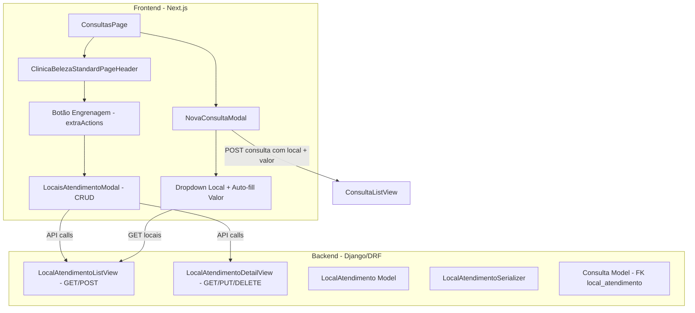

# Design: Locais de Atendimento — Consulta

## Overview

Esta funcionalidade introduz o modelo `LocalAtendimento` no módulo Clínica da Beleza, permitindo configurar locais onde consultas são realizadas (ex: Consultório, Home Care, Telemedicina) com um valor padrão de consulta associado. A integração com o fluxo de criação de consultas permite o preenchimento automático do valor ao selecionar um local, com possibilidade de override manual. O gerenciamento dos locais é feito via modal acessível por botão de configuração na página de consultas.

### Decisões de Design

- **Soft delete**: locais são desativados via `is_active=False` ao invés de exclusão permanente, preservando referências históricas em consultas já realizadas.
- **FK nullable**: a referência ao local na Consulta é opcional (`null=True`) para manter retrocompatibilidade com consultas existentes e permitir o fluxo sem local quando nenhum estiver cadastrado.
- **Valor override**: o valor do local preenche automaticamente, mas o profissional pode alterar manualmente — o valor enviado na criação é o que prevalece.
- **Modal CRUD**: o gerenciamento de locais usa modal (ação simples conforme convenção do projeto), não página dedicada.

---

## Architecture



### Fluxo de Dados

1. **Listagem de Locais**: `GET /api/clinica-beleza/locais-atendimento/` → retorna locais ativos da loja
2. **Criação de Local**: `POST /api/clinica-beleza/locais-atendimento/` → cria novo local
3. **Edição de Local**: `PUT /api/clinica-beleza/locais-atendimento/<pk>/` → atualiza local
4. **Exclusão de Local**: `DELETE /api/clinica-beleza/locais-atendimento/<pk>/` → soft delete
5. **Criação de Consulta**: `POST /api/clinica-beleza/consultas/` → agora aceita `local_atendimento` e `valor_consulta`

---

## Components and Interfaces

### Backend

#### Model: `LocalAtendimento`

```python
class LocalAtendimento(LojaIsolationMixin, models.Model):
    nome = models.CharField(max_length=200, verbose_name="Nome do local")
    valor_consulta = models.DecimalField(max_digits=10, decimal_places=2, verbose_name="Valor da consulta (R$)")
    is_active = models.BooleanField(default=True, verbose_name="Ativo")
    created_at = models.DateTimeField(auto_now_add=True)
    updated_at = models.DateTimeField(auto_now=True)

    objects = LojaIsolationManager()

    class Meta:
        app_label = 'clinica_beleza'
        db_table = 'clinica_beleza_locais_atendimento'
        ordering = ['nome']
        verbose_name = 'Local de atendimento'
        verbose_name_plural = 'Locais de atendimento'
```

#### Alteração no Model `Consulta`

```python
# Novo campo no model Consulta:
local_atendimento = models.ForeignKey(
    'LocalAtendimento',
    on_delete=models.SET_NULL,
    null=True, blank=True,
    related_name='consultas',
    verbose_name='Local de atendimento',
)
```

#### Serializer: `LocalAtendimentoSerializer`

```python
class LocalAtendimentoSerializer(serializers.ModelSerializer):
    class Meta:
        model = LocalAtendimento
        fields = ['id', 'nome', 'valor_consulta', 'is_active', 'created_at', 'updated_at']
        read_only_fields = ['id', 'is_active', 'created_at', 'updated_at']

    def validate_nome(self, value):
        if not value or not value.strip():
            raise serializers.ValidationError('O nome do local é obrigatório.')
        return value.strip()

    def validate_valor_consulta(self, value):
        if value is None or value < 0:
            raise serializers.ValidationError('O valor deve ser maior ou igual a zero.')
        return value
```

#### Views: `LocalAtendimentoListView` e `LocalAtendimentoDetailView`

- Seguem o padrão `APIView` + `GetObjectMixin` do projeto.
- `LocalAtendimentoListView`: GET (lista ativos), POST (cria novo).
- `LocalAtendimentoDetailView`: GET (detalhe), PUT (atualiza), DELETE (soft delete).
- Ambas usam `resolve_loja_id_from_request()` para isolamento de tenant.

#### Alteração no `ConsultaSerializer`

```python
# Adicionar campo no ConsultaSerializer:
local_atendimento_name = serializers.CharField(
    source='local_atendimento.nome', read_only=True, default=None
)
```

#### Alteração no `consulta_service.py` — `criar_consulta_avulsa`

Aceitar parâmetro opcional `local_atendimento` e `valor_consulta_override`:
- Se `local_atendimento` é informado, usar seu `valor_consulta` como padrão.
- Se `valor_consulta_override` é informado, usar este valor no lugar.

### Frontend

#### Novo Componente: `LocaisAtendimentoModal`

Modal com CRUD completo de locais:
- Lista locais com nome e valor formatado (R$ X,XX)
- Formulário inline para adicionar/editar (campos: nome, valor)
- Botão excluir com confirmação (`confirm()`)
- Atualização da lista sem reload (estado local)

#### Alteração: `ConsultasPage`

- Adicionar botão de engrenagem no header via prop `extraActions` do `ClinicaBelezaStandardPageHeader`
- Controlar visibilidade do `LocaisAtendimentoModal`

#### Alteração: `NovaConsultaModal`

- Carregar locais de atendimento ativos via API
- Se existem locais: exibir dropdown de seleção de local
- Ao selecionar local: auto-preencher campo `valor_consulta` (editável)
- Se não existem locais: ocultar dropdown, manter comportamento atual
- Enviar `local_atendimento` e `valor_consulta` no payload de criação

#### Alteração: `consultas-types.ts`

```typescript
// Adicionar ao interface Consulta:
local_atendimento?: number | null;
local_atendimento_name?: string | null;
```

#### Nova Interface:

```typescript
export interface LocalAtendimento {
  id: number;
  nome: string;
  valor_consulta: string | number;
  is_active: boolean;
  created_at: string;
  updated_at: string;
}
```

---

## Data Models

### LocalAtendimento

| Campo          | Tipo                    | Restrições                        |
|----------------|-------------------------|-----------------------------------|
| id             | AutoField (PK)          | Auto-gerado                       |
| loja_id        | Integer                 | LojaIsolationMixin (automático)   |
| nome           | CharField(200)          | Obrigatório, não vazio            |
| valor_consulta | DecimalField(10,2)      | Obrigatório, >= 0                 |
| is_active      | BooleanField            | Default: True                     |
| created_at     | DateTimeField           | auto_now_add                      |
| updated_at     | DateTimeField           | auto_now                          |

### Consulta (alteração)

| Campo              | Tipo                          | Restrições          |
|--------------------|-------------------------------|---------------------|
| local_atendimento  | ForeignKey(LocalAtendimento)  | null=True, blank=True, SET_NULL |

### Endpoint da API

| Método | Endpoint                                      | Descrição                  |
|--------|-----------------------------------------------|----------------------------|
| GET    | `/api/clinica-beleza/locais-atendimento/`     | Lista locais ativos        |
| POST   | `/api/clinica-beleza/locais-atendimento/`     | Cria novo local            |
| GET    | `/api/clinica-beleza/locais-atendimento/<pk>/`| Detalhe do local           |
| PUT    | `/api/clinica-beleza/locais-atendimento/<pk>/`| Atualiza local             |
| DELETE | `/api/clinica-beleza/locais-atendimento/<pk>/`| Soft delete (is_active=False) |

---

## Correctness Properties

*Uma propriedade é uma característica ou comportamento que deve ser verdadeiro em todas as execuções válidas de um sistema — essencialmente, uma declaração formal sobre o que o sistema deve fazer. Propriedades servem como ponte entre especificações legíveis por humanos e garantias de corretude verificáveis por máquina.*

### Property 1: Round-trip de criação de Local de Atendimento

*Para qualquer* nome válido (1-200 caracteres, não vazio, não apenas whitespace) e valor_consulta válido (decimal >= 0 com até 10 dígitos e 2 casas decimais), ao criar um LocalAtendimento via POST e recuperá-lo via GET, os campos retornados devem ser idênticos aos enviados.

**Validates: Requirements 1.1, 2.2**

### Property 2: Isolamento de dados por loja

*Para quaisquer* dois contextos de loja distintos, os locais de atendimento criados em uma loja não devem ser visíveis na listagem da outra loja.

**Validates: Requirements 1.2**

### Property 3: Rejeição de nome vazio ou whitespace

*Para qualquer* string composta inteiramente de whitespace (incluindo string vazia, espaços, tabs), a tentativa de criar ou atualizar um LocalAtendimento com esse nome deve ser rejeitada pelo sistema.

**Validates: Requirements 1.3, 2.5**

### Property 4: Rejeição de valor negativo

*Para qualquer* número decimal negativo, a tentativa de criar ou atualizar um LocalAtendimento com esse valor_consulta deve ser rejeitada pelo sistema.

**Validates: Requirements 1.4, 2.6**

### Property 5: Soft delete oculta da listagem ativa

*Para qualquer* LocalAtendimento ativo, ao executar DELETE (soft delete), o local não deve mais aparecer na listagem de locais ativos (GET), mas deve continuar existindo no banco de dados com is_active=False.

**Validates: Requirements 1.6, 2.1, 2.4**

### Property 6: Acesso cross-loja retorna 404

*Para qualquer* ID de LocalAtendimento pertencente a uma loja diferente da loja corrente na requisição, operações GET, PUT e DELETE devem retornar status 404.

**Validates: Requirements 2.7**

### Property 7: Auto-preenchimento do valor ao selecionar local

*Para qualquer* LocalAtendimento ativo com valor_consulta configurado, ao selecioná-lo no dropdown da NovaConsultaModal, o campo de valor da consulta deve ser preenchido automaticamente com o valor_consulta daquele local.

**Validates: Requirements 4.2**

### Property 8: Consulta armazena local e valor com suporte a override

*Para qualquer* LocalAtendimento e qualquer valor de override manual (>= 0), ao criar uma consulta: se um override é fornecido, o valor_consulta da consulta deve ser o override; caso contrário, deve ser o valor_consulta do local selecionado. Em ambos os casos, a FK local_atendimento deve ser armazenada corretamente.

**Validates: Requirements 4.5, 5.2, 5.3**

---

## Error Handling

| Cenário                                    | Resposta                                          |
|--------------------------------------------|---------------------------------------------------|
| POST/PUT com nome vazio                    | 400 + `{ "nome": ["O nome do local é obrigatório."] }` |
| POST/PUT com valor negativo                | 400 + `{ "valor_consulta": ["O valor deve ser maior ou igual a zero."] }` |
| GET/PUT/DELETE com ID inexistente          | 404 + `{ "error": "Local de atendimento não encontrado" }` |
| GET/PUT/DELETE com ID de outra loja        | 404 + `{ "error": "Local de atendimento não encontrado" }` |
| Falha de rede no frontend (CRUD modal)     | Toast/alert com mensagem genérica de erro          |
| Nenhum local cadastrado (NovaConsultaModal)| Dropdown oculto, fluxo existente preservado        |

---

## Testing Strategy

### Testes Unitários (example-based)

- Criação de LocalAtendimento com dados válidos
- Campos de auditoria (created_at, updated_at) preenchidos automaticamente
- Soft delete preserva o registro no banco
- Consulta sem local (null FK) funciona normalmente
- NovaConsultaModal oculta dropdown quando não há locais cadastrados
- Valor editável após auto-preenchimento

### Testes de Propriedade (property-based)

- **Biblioteca**: `hypothesis` (Python/Django backend)
- **Mínimo 100 iterações** por propriedade
- Cada teste referencia a propriedade do design correspondente

**Propriedades a implementar:**

1. **Feature: locais-atendimento-consulta, Property 1**: Round-trip de criação — gerar nomes (1-200 chars não-whitespace) e valores (Decimal >= 0), criar via serializer, verificar que dados retornados são idênticos.
2. **Feature: locais-atendimento-consulta, Property 3**: Rejeição de whitespace — gerar strings de whitespace variadas, verificar rejeição pelo serializer.
3. **Feature: locais-atendimento-consulta, Property 4**: Rejeição de negativos — gerar Decimals negativos, verificar rejeição pelo serializer.
4. **Feature: locais-atendimento-consulta, Property 5**: Soft delete oculta — criar N locais, deletar subconjunto aleatório, verificar que GET retorna apenas os ativos.
5. **Feature: locais-atendimento-consulta, Property 8**: Valor com override — gerar locais com valores aleatórios + override opcional, criar consulta, verificar valor armazenado.

### Testes de Integração

- API end-to-end: CRUD completo com autenticação e isolamento de loja
- Criação de consulta com local selecionado via API
- Verificação de isolamento multi-tenant em cenário real

### Testes Frontend (manual/E2E)

- Modal CRUD de locais abre e permite operações
- Dropdown de locais na NovaConsultaModal funciona
- Auto-preenchimento e override de valor funcionam
- Lista atualiza sem reload após operações CRUD
