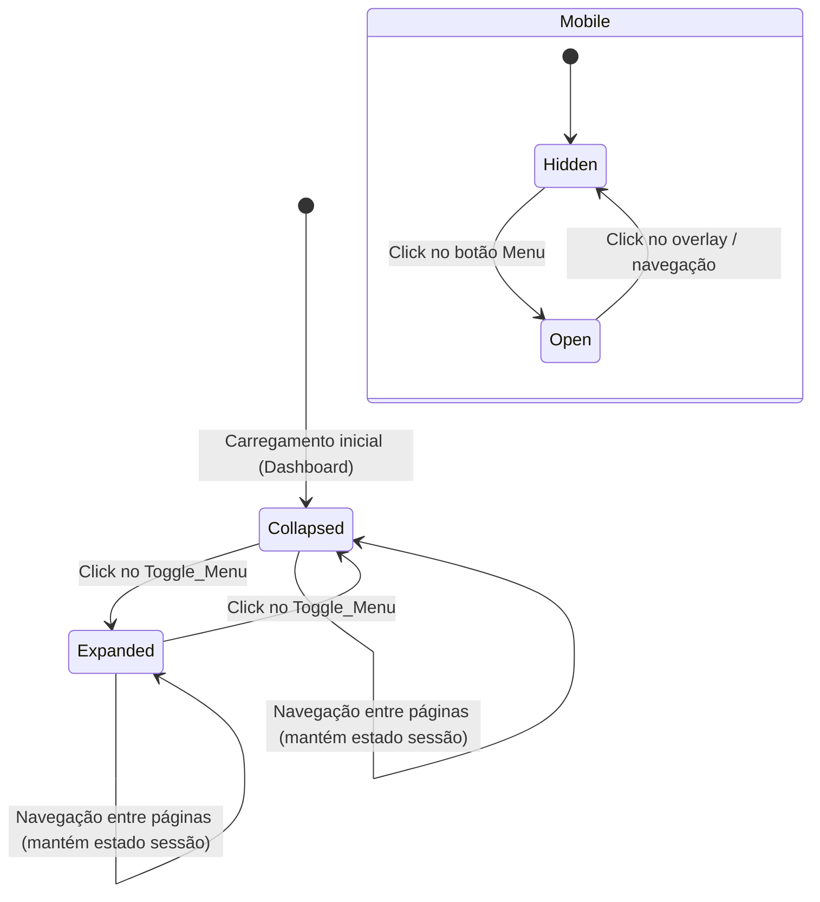

# Design Document — Menu Oculto + Admin como Profissional

## Overview

Esta feature implementa duas melhorias complementares na UX do administrador da Clínica da Beleza:

1. **Sidebar recolhida por padrão no Dashboard** — O componente `ClinicaBelezaShell` inicia com `sidebarCollapsed = true`, maximizando a área útil. O usuário pode expandir manualmente e o estado persiste durante a sessão via `sessionStorage`.

2. **Admin como Profissional** — Um endpoint e toggle na página de profissionais permitem que o owner da loja se habilite/desabilite como `Professional`, usando soft-delete (`is_active`) para preservar histórico.

### Decisões de Design

| Decisão | Justificativa |
|---------|---------------|
| Estado do sidebar via `sessionStorage` | Persiste na sessão sem poluir o banco. Reset entre sessões é aceitável (UX limpa). |
| Soft-delete (`is_active=false`) em vez de DELETE | Preserva vínculos na agenda, consultas passadas e dados profissionais. |
| Endpoint dedicado `POST /professionals/toggle-admin/` | Isolamento claro da lógica; não mistura com CRUD genérico de profissionais. |
| Service layer `admin_professional_service.py` | Segue convenção do projeto — lógica de negócio fora de views. |
| Não criar `ProfissionalUsuario` para o owner | O owner já tem acesso à loja via `loja.owner_id`; não precisa de vínculo duplicado. |

## Architecture

```mermaid
sequenceDiagram
    participant FE as Frontend (Next.js)
    participant API as Backend (DRF)
    participant SVC as admin_professional_service
    participant DB as PostgreSQL (schema loja)

    Note over FE: Página Profissionais carrega
    FE->>API: GET /professionals/admin-status/
    API->>DB: Professional.objects.filter(email=owner.email)
    DB-->>API: Professional | None
    API-->>FE: { is_enabled: bool, professional_id: int|null }

    Note over FE: Admin ativa toggle
    FE->>API: POST /professionals/toggle-admin/ { enable: true }
    API->>SVC: habilitar_admin_como_profissional(loja_id, user)
    SVC->>DB: Professional.objects.get_or_create(...)
    SVC->>DB: professional.is_active = True; save()
    DB-->>SVC: OK
    SVC-->>API: Professional instance
    API-->>FE: { success: true, professional: {...} }

    Note over FE: Admin desativa toggle
    FE->>API: POST /professionals/toggle-admin/ { enable: false }
    API->>SVC: desabilitar_admin_como_profissional(loja_id, user)
    SVC->>DB: professional.is_active = False; save()
    DB-->>SVC: OK
    SVC-->>API: { success: true }
    API-->>FE: { success: true }
```

### Sidebar — Fluxo de Estado



## Components and Interfaces

### Backend

#### `admin_professional_service.py` (novo)

```python
def habilitar_admin_como_profissional(loja_id: int, user) -> Professional:
    """
    Cria ou reativa o registro Professional vinculado ao owner.
    - Se já existe com is_active=False → reativa (is_active=True)
    - Se já existe com is_active=True → retorna (idempotente)
    - Se não existe → cria com nome/email do user
    """
    ...

def desabilitar_admin_como_profissional(loja_id: int, user) -> None:
    """
    Desativa o Professional do owner (is_active=False).
    Não remove o registro do banco.
    """
    ...

def obter_status_admin_profissional(loja_id: int, user) -> dict:
    """
    Retorna { is_enabled: bool, professional_id: int|null }
    """
    ...
```

#### `views_admin_professional.py` (novo)

```python
class AdminProfessionalStatusView(APIView):
    """GET /professionals/admin-status/ — estado do toggle"""
    permission_classes = [IsAuthenticated]
    ...

class AdminProfessionalToggleView(APIView):
    """POST /professionals/toggle-admin/ — habilitar/desabilitar"""
    permission_classes = [IsAuthenticated]
    ...
```

#### Validação de Permissão

Ambos os endpoints verificam:
1. `request.user.is_authenticated`
2. `loja.owner_id == request.user.id` (somente owner pode executar)

Se o usuário não é owner, retorna `403 Forbidden`.

### Frontend

#### Alteração em `ClinicaBelezaShell.tsx`

```typescript
// Estado inicial baseado em sessionStorage
const [sidebarCollapsed, setSidebarCollapsed] = useState(() => {
  if (typeof window === 'undefined') return true;
  const stored = sessionStorage.getItem('sidebar-collapsed');
  return stored !== null ? stored === 'true' : true; // default: recolhido
});

// Persistir mudanças na sessão
useEffect(() => {
  sessionStorage.setItem('sidebar-collapsed', String(sidebarCollapsed));
}, [sidebarCollapsed]);
```

#### Novo componente: `AdminProfissionalToggle.tsx`

```typescript
interface AdminProfissionalToggleProps {
  slug: string;
  onToggled: () => void; // callback para recarregar lista
}

function AdminProfissionalToggle({ slug, onToggled }: AdminProfissionalToggleProps) {
  // GET /professionals/admin-status/ ao montar
  // POST /professionals/toggle-admin/ ao clicar
  // Mostra switch com label "Habilitar como profissional"
  // Em caso de erro: reverte switch + toast de erro
}
```

Posicionamento: renderizado acima da tabela na página de profissionais, visível apenas quando o user é owner (`lojaOwnerInfo !== null` e `user.id === owner_id`).

### URLs (adição em `clinica_beleza/urls.py`)

```python
path('professionals/admin-status/', AdminProfessionalStatusView.as_view()),
path('professionals/toggle-admin/', AdminProfessionalToggleView.as_view()),
```

## Data Models

### Modelo existente: `Professional` (sem alterações de schema)

O `Professional` já possui todos os campos necessários:
- `nome` (CharField) — preenchido com `user.first_name` ou `user.username`
- `email` (EmailField) — preenchido com `user.email`
- `telefone` (CharField) — preenchido com `loja.owner_telefone` ou vazio
- `especialidade` (CharField) — default: `"Administrador"` (editável depois)
- `is_active` (BooleanField) — controla visibilidade
- `loja_id` (via `LojaIsolationMixin`) — isolamento multi-tenant automático

### Identificação do Professional do Admin

Usaremos o `email` do owner como chave de identificação:

```python
Professional.objects.filter(email=owner_user.email, loja_id=loja_id)
```

Não é necessário campo adicional (`is_owner`, `user_id`, etc.) porque:
- Cada loja tem exatamente um owner
- O email do owner é único por loja
- O campo `is_administrador_vinculado` já é calculado na view de listagem (campo virtual no serializer)

### Fluxo de Dados — sessionStorage (sidebar)

| Key | Tipo | Default | Descrição |
|-----|------|---------|-----------|
| `sidebar-collapsed` | `"true" \| "false"` | `"true"` | Estado do menu lateral na sessão |

## Correctness Properties

*Uma propriedade é uma característica ou comportamento que deve se manter verdadeiro em todas as execuções válidas de um sistema — essencialmente, uma declaração formal sobre o que o sistema deve fazer. Propriedades servem como ponte entre especificações legíveis por humanos e garantias de corretude verificáveis por máquina.*

### Property 1: Criação correta do Professional do admin

*Para qualquer* admin (owner) com nome e email válidos, ao habilitar como profissional, o sistema deve criar um registro `Professional` com `nome` igual ao nome do admin, `email` igual ao email do admin, `loja_id` igual ao ID da loja do admin, e `is_active = True`.

**Validates: Requirements 2.2, 3.3**

### Property 2: Desativação preserva registro (soft-delete)

*Para qualquer* `Professional` ativo vinculado a um admin, ao desabilitar via toggle, o registro deve continuar existindo no banco de dados com `is_active = False` (nunca é deletado).

**Validates: Requirements 2.4**

### Property 3: Lista de profissionais exclui inativos

*Para qualquer* conjunto de registros `Professional` em uma loja (com qualquer combinação de `is_active` true/false), a listagem retornada pelo endpoint `GET /professionals/` deve conter exclusivamente profissionais com `is_active = True`.

**Validates: Requirements 2.5**

## Error Handling

| Cenário | Backend | Frontend |
|---------|---------|----------|
| Usuário não é owner da loja | `403 Forbidden` com mensagem | Toggle não renderizado (verificação prévia) |
| Professional já existe e ativo (toggle enable) | Retorna sucesso (idempotente) | Nenhuma ação adicional |
| Professional não existe (toggle disable) | `404 Not Found` | Toast de erro, toggle reverte |
| Erro de rede/timeout | N/A | Toast "Erro ao comunicar com servidor", toggle reverte ao estado anterior |
| Loja não encontrada (header inválido) | `400 Bad Request` | Redireciona para login |
| Campos obrigatórios faltando na criação | Nunca ocorre (dados vêm do user autenticado) | N/A |

### Idempotência

- `POST toggle-admin { enable: true }` quando já habilitado → sucesso (noop)
- `POST toggle-admin { enable: false }` quando já desabilitado → sucesso (noop)

## Testing Strategy

### Testes Unitários (Backend — pytest + Django TestCase)

1. **Service layer** (`test_admin_professional_service.py`):
   - Criar profissional do admin → verifica dados
   - Desativar → verifica `is_active=False` e registro existe
   - Reativar → verifica `is_active=True`
   - Idempotência: habilitar quando já habilitado

2. **Views** (`test_views_admin_professional.py`):
   - Status endpoint retorna correto para owner
   - Toggle endpoint funciona para owner
   - Retorna 403 para não-owner
   - Retorna 403 para usuário anônimo

3. **Sidebar** (frontend — vitest + testing-library):
   - Estado inicial collapsed quando sessionStorage está vazio
   - Estado persiste em sessionStorage após toggle
   - Estado mantido entre re-renders (simulando navegação)

### Testes Property-Based (Backend — hypothesis)

Biblioteca: **hypothesis** (Python)

Configuração: mínimo 100 iterações por propriedade.

- **Property 1**: Gerar admins com nomes/emails variados → `habilitar_admin_como_profissional` → verificar Professional com dados corretos
  - Tag: `Feature: menu-oculto-admin-profissional, Property 1: Para qualquer admin com nome/email válidos, habilitar cria Professional com dados corretos e loja_id correspondente`

- **Property 2**: Gerar Professional ativo → `desabilitar_admin_como_profissional` → verificar que `Professional.objects.filter(pk=id).exists()` é True e `is_active=False`
  - Tag: `Feature: menu-oculto-admin-profissional, Property 2: Para qualquer Professional ativo do admin, desativar preserva registro com is_active=False`

- **Property 3**: Gerar lista de Professionals com mix de `is_active` → filtrar via queryset da listagem → verificar que nenhum inativo aparece
  - Tag: `Feature: menu-oculto-admin-profissional, Property 3: Para qualquer conjunto de profissionais, a listagem retorna apenas is_active=True`

### Testes de Integração

- Toggle completo: habilitar → verificar na lista → desabilitar → verificar ausência na lista
- Re-login: habilitar → simular novo request → verificar status correto

### Validação Pré-deploy

- `python3 manage.py check` — sem erros
- `getDiagnostics` nos arquivos frontend alterados — sem erros
- Testar manualmente em loja de staging o fluxo completo do toggle
