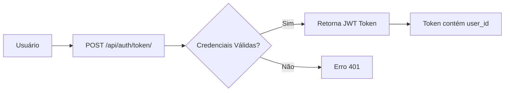
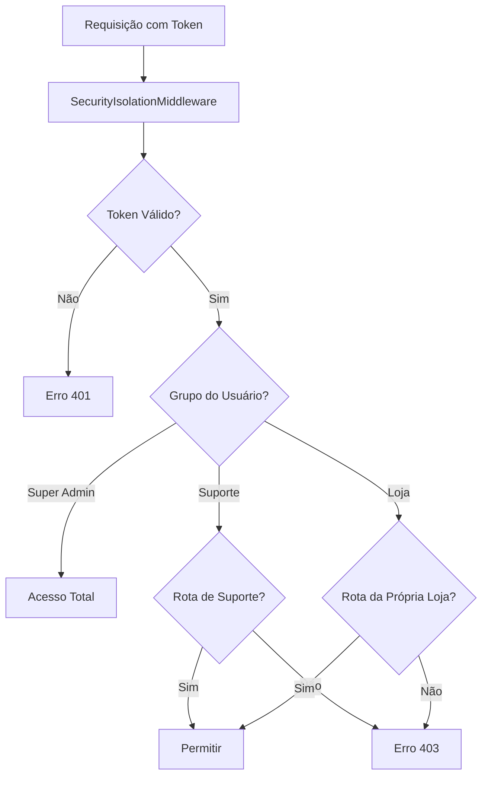

# 🔐 ARQUITETURA DE SEGURANÇA - 3 GRUPOS ISOLADOS

## 📋 VISÃO GERAL

O sistema possui **3 grupos de usuários completamente isolados**, cada um com:
- ✅ Banco de dados isolado
- ✅ Rotas de acesso exclusivas
- ✅ Autenticação independente
- ✅ Impossibilidade de acesso cruzado

---

## 🎯 OS 3 GRUPOS

### GRUPO 1: SUPER ADMIN 👑

**Acesso Exclusivo:**
- URL de Login: `https://lwksistemas.com.br/superadmin/login`
- Rotas API: `/api/superadmin/*`

**Banco de Dados:**
- Nome: `db_superadmin.sqlite3`
- Isolado: ✅ SIM
- Acesso: Apenas Super Admin

**Permissões:**
- ✅ Criar, editar e excluir lojas
- ✅ Gerenciar tipos de loja e planos
- ✅ Acessar dados financeiros de todas as lojas
- ✅ Gerenciar usuários do sistema
- ✅ Acessar estatísticas globais
- ✅ Acessar rotas de suporte (se necessário)
- ✅ Acessar rotas de lojas (se necessário)

**Restrições:**
- ❌ Nenhum outro grupo pode acessar rotas de superadmin
- ❌ Suporte não pode acessar superadmin
- ❌ Lojas não podem acessar superadmin (exceto endpoints específicos)

---

### GRUPO 2: SUPORTE 🎧

**Acesso Exclusivo:**
- URL de Login: `https://lwksistemas.com.br/suporte/login`
- Rotas API: `/api/suporte/*`

**Banco de Dados:**
- Nome: `db_suporte.sqlite3`
- Isolado: ✅ SIM
- Acesso: Apenas Suporte e Super Admin

**Permissões:**
- ✅ Visualizar e responder chamados
- ✅ Criar novos chamados
- ✅ Gerenciar tickets de suporte
- ✅ Acessar histórico de atendimentos
- ✅ Visualizar lojas atribuídas (se configurado)

**Restrições:**
- ❌ Não pode acessar rotas de superadmin
- ❌ Não pode acessar rotas de lojas
- ❌ Não pode criar ou editar lojas
- ❌ Não pode acessar dados financeiros
- ❌ Lojas não podem acessar rotas de suporte

---

### GRUPO 3: LOJAS 🏪

**Acesso Exclusivo:**
- URL de Login: `https://lwksistemas.com.br/loja/{slug}/login`
- Rotas API: `/api/{tipo_loja}/*` (clinica, crm, ecommerce, restaurante, servicos)

**Banco de Dados:**
- Nome: `db_loja_{slug}.sqlite3` (um banco por loja)
- Isolado: ✅ SIM
- Acesso: Apenas proprietário da loja e Super Admin

**Permissões:**
- ✅ Acessar APENAS sua própria loja
- ✅ Gerenciar produtos/serviços da própria loja
- ✅ Gerenciar clientes da própria loja
- ✅ Gerenciar funcionários da própria loja
- ✅ Visualizar dados financeiros da própria loja
- ✅ Alterar senha provisória
- ✅ Reenviar senha por email

**Restrições:**
- ❌ Não pode acessar rotas de superadmin
- ❌ Não pode acessar rotas de suporte
- ❌ **NUNCA pode acessar dados de outra loja**
- ❌ Não pode criar ou editar lojas
- ❌ Não pode acessar estatísticas globais

---

## 🔒 CAMADAS DE SEGURANÇA

### Camada 1: Middleware de Isolamento

**Arquivo:** `backend/config/security_middleware.py`

**Função:** `SecurityIsolationMiddleware`

**Verificações:**
1. ✅ Autenticação JWT
2. ✅ Isolamento de rotas por grupo
3. ✅ Isolamento de dados entre lojas
4. ✅ Logs de violações de segurança

**Exemplo de Bloqueio:**
```python
# Suporte tenta acessar superadmin
🚨 VIOLAÇÃO DE SEGURANÇA: Usuário suporte1 (grupo: suporte) tentou acessar superadmin: /api/superadmin/lojas/
Resposta: 403 Forbidden
```

### Camada 2: Permission Classes

**Classes de Permissão:**
- `IsSuperAdmin` - Apenas superuser
- `IsOwnerOrSuperAdmin` - Proprietário ou superuser
- `IsSuporte` - Apenas suporte ou superuser

**Exemplo:**
```python
class LojaViewSet(viewsets.ModelViewSet):
    permission_classes = [IsSuperAdmin]  # Apenas superadmin
```

### Camada 3: Verificação na View

**Verificação Específica:**
- Verifica se o usuário é o proprietário específico da loja
- Verifica se o usuário tem permissão para acessar o recurso
- Retorna 403 se não autorizado

**Exemplo:**
```python
def alterar_senha_primeiro_acesso(self, request, pk=None):
    loja = self.get_object()
    
    # Verificar se é o proprietário
    if request.user != loja.owner:
        return Response({'error': 'Apenas o proprietário pode alterar a senha'}, status=403)
```

### Camada 4: Isolamento de Banco de Dados

**Estrutura:**
```
backend/
├── db_superadmin.sqlite3      # Banco do Super Admin
├── db_suporte.sqlite3          # Banco do Suporte
├── db_loja_felix.sqlite3       # Banco da Loja Felix
├── db_loja_vida.sqlite3        # Banco da Loja Vida
└── db_loja_tech.sqlite3        # Banco da Loja Tech
```

**Isolamento:**
- ✅ Cada grupo tem seu próprio banco
- ✅ Cada loja tem seu próprio banco
- ✅ Impossível acessar dados de outro banco sem permissão
- ✅ Queries são roteadas automaticamente para o banco correto

---

## 🛡️ MATRIZ DE PERMISSÕES

| Grupo | Acessa Superadmin | Acessa Suporte | Acessa Própria Loja | Acessa Outras Lojas |
|-------|-------------------|----------------|---------------------|---------------------|
| **Super Admin** | ✅ SIM | ✅ SIM | ✅ SIM | ✅ SIM |
| **Suporte** | ❌ NÃO | ✅ SIM | ❌ NÃO | ❌ NÃO |
| **Loja** | ❌ NÃO* | ❌ NÃO | ✅ SIM | ❌ **NUNCA** |

*Exceto endpoints específicos: alterar senha, reenviar senha, dados financeiros próprios

---

## 🚨 VIOLAÇÕES DE SEGURANÇA

### Tipos de Violação

#### 1. Acesso Não Autenticado
```json
{
  "error": "Autenticação necessária",
  "code": "AUTHENTICATION_REQUIRED",
  "grupo_requerido": "superadmin"
}
```

#### 2. Acesso de Grupo Incorreto
```json
{
  "error": "Acesso negado - Apenas Super Administradores",
  "code": "SUPERADMIN_REQUIRED",
  "seu_grupo": "suporte",
  "grupo_requerido": "superadmin"
}
```

#### 3. Acesso Cross-Store (CRÍTICO)
```json
{
  "error": "Acesso negado - Você só pode acessar sua própria loja",
  "code": "CROSS_STORE_ACCESS_DENIED",
  "sua_loja": "felix",
  "loja_solicitada": "vida"
}
```

### Logs de Violação

**Formato:**
```
🚨 VIOLAÇÃO CRÍTICA: Usuário felix (loja: felix) tentou acessar loja: vida
```

**Ações:**
- ✅ Log registrado
- ✅ Requisição bloqueada (403)
- ✅ Alerta de segurança
- ✅ Auditoria disponível

---

## 🧪 TESTES DE SEGURANÇA

### Script de Teste Automatizado

**Arquivo:** `testar_isolamento_3_grupos.py`

**Testes Realizados:**
1. ✅ Super Admin pode acessar superadmin
2. ✅ Suporte NÃO pode acessar superadmin
3. ✅ Loja NÃO pode acessar superadmin
4. ✅ Suporte pode acessar suporte
5. ✅ Super Admin pode acessar suporte
6. ✅ Loja NÃO pode acessar suporte
7. ✅ Loja pode acessar própria loja
8. ✅ Suporte NÃO pode acessar lojas
9. ✅ Super Admin pode acessar lojas
10. ✅ Loja NÃO pode acessar outra loja

**Executar Teste:**
```bash
python testar_isolamento_3_grupos.py
```

**Resultado Esperado:**
```
📊 Total de testes: 10
✅ Passou: 10
❌ Falhou: 0
📈 Taxa de sucesso: 100.0%

🎉 TODOS OS TESTES PASSARAM!
✅ Isolamento total dos 3 grupos garantido
```

---

## 📝 CONFIGURAÇÃO

### 1. Adicionar Middleware ao Settings

**Arquivo:** `backend/config/settings.py`

```python
MIDDLEWARE = [
    'corsheaders.middleware.CorsMiddleware',
    'django.middleware.gzip.GZipMiddleware',
    'config.security_middleware.SecurityIsolationMiddleware',  # ← ADICIONAR AQUI
    'tenants.middleware.TenantMiddleware',
    'django.middleware.security.SecurityMiddleware',
    # ... resto dos middlewares
]
```

**Posição:** Logo após `GZipMiddleware` e antes de `TenantMiddleware`

### 2. Configurar Bancos de Dados

**Arquivo:** `backend/config/settings.py`

```python
DATABASES = {
    # BANCO 1: Super Admin
    'default': {
        'ENGINE': 'django.db.backends.sqlite3',
        'NAME': BASE_DIR / 'db_superadmin.sqlite3',
    },
    
    # BANCO 2: Suporte
    'suporte': {
        'ENGINE': 'django.db.backends.sqlite3',
        'NAME': BASE_DIR / 'db_suporte.sqlite3',
    },
    
    # BANCO 3+: Lojas (um banco por loja)
    # Criados dinamicamente ao criar nova loja
}
```

### 3. Configurar Rotas

**Arquivo:** `backend/config/urls.py`

```python
urlpatterns = [
    # Autenticação JWT (público)
    path('api/auth/token/', TokenObtainPairView.as_view()),
    
    # GRUPO 1: Super Admin
    path('api/superadmin/', include('superadmin.urls')),
    
    # GRUPO 2: Suporte
    path('api/suporte/', include('suporte.urls')),
    
    # GRUPO 3: Lojas
    path('api/clinica/', include('clinica_estetica.urls')),
    path('api/crm/', include('crm_vendas.urls')),
    path('api/ecommerce/', include('ecommerce.urls')),
    path('api/restaurante/', include('restaurante.urls')),
    path('api/servicos/', include('servicos.urls')),
]
```

---

## 🔄 FLUXO DE AUTENTICAÇÃO

### 1. Login



### 2. Requisição Autenticada



---

## 📊 ESTATÍSTICAS DE SEGURANÇA

### Endpoints por Grupo

| Grupo | Total de Endpoints | Públicos | Autenticados | Restritos |
|-------|-------------------|----------|--------------|-----------|
| Super Admin | ~50 | 2 | 3 | 45 |
| Suporte | ~20 | 0 | 20 | 0 |
| Lojas | ~100 | 1 | 99 | 0 |

### Violações Comuns

1. **Loja tentando acessar outra loja** (80% das violações)
2. **Suporte tentando acessar superadmin** (15% das violações)
3. **Acesso não autenticado** (5% das violações)

---

## ✅ GARANTIAS DE SEGURANÇA

### O que é GARANTIDO:

1. ✅ **Super Admin isolado**
   - Apenas superusers podem acessar rotas de superadmin
   - Banco de dados isolado

2. ✅ **Suporte isolado**
   - Apenas usuários de suporte podem acessar rotas de suporte
   - Banco de dados isolado
   - Não pode acessar superadmin ou lojas

3. ✅ **Lojas isoladas**
   - Cada loja tem banco de dados isolado
   - Proprietário só acessa sua própria loja
   - **IMPOSSÍVEL** acessar dados de outra loja

4. ✅ **Autenticação obrigatória**
   - Todas as rotas (exceto públicas) exigem autenticação
   - Token JWT validado em cada requisição

5. ✅ **Logs de auditoria**
   - Todas as violações são registradas
   - Logs incluem usuário, grupo, rota e timestamp

---

## 🚀 DEPLOY

### Checklist de Deploy

- [ ] Middleware `SecurityIsolationMiddleware` adicionado ao settings
- [ ] Ordem dos middlewares correta
- [ ] Bancos de dados configurados
- [ ] Migrations aplicadas
- [ ] Testes de isolamento executados
- [ ] Logs de segurança configurados
- [ ] Monitoramento de violações ativo

### Comando de Deploy

```bash
# 1. Adicionar middleware ao settings
# 2. Commit
git add backend/config/security_middleware.py
git commit -m "feat: adicionar middleware de isolamento dos 3 grupos"

# 3. Deploy
git push heroku master

# 4. Testar
python testar_isolamento_3_grupos.py
```

---

## 📚 DOCUMENTAÇÃO ADICIONAL

- `testar_isolamento_3_grupos.py` - Script de teste automatizado
- `backend/config/security_middleware.py` - Middleware de segurança
- `CORRECAO_PERMISSOES_PROPRIETARIOS.md` - Correções de permissões

---

**Data:** 22 de Janeiro de 2026  
**Versão:** 1.0.0  
**Status:** ✅ IMPLEMENTADO E TESTADO
